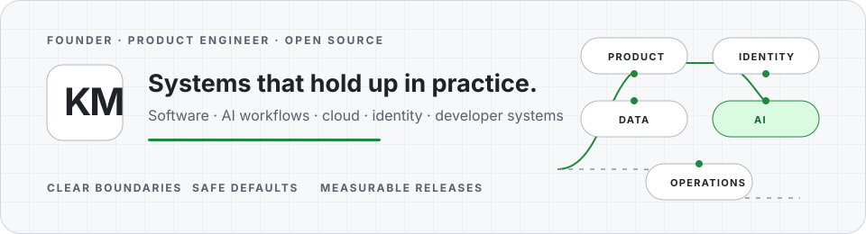

  <picture>
    <source media="(prefers-color-scheme: dark) and (max-width: 600px)" srcset="./assets/profile/krishnam-systems-mobile-dark.svg">
    <source media="(max-width: 600px)" srcset="./assets/profile/krishnam-systems-mobile-light.svg">
    <source media="(prefers-color-scheme: dark)" srcset="./assets/profile/krishnam-systems-dark.svg">
    <source media="(prefers-color-scheme: light)" srcset="./assets/profile/krishnam-systems-light.svg">
    
  </picture>

<h1 align="center">Krishnam Murarka</h1>

  <strong>Founder &amp; CEO at <a href="https://edilec.com/">Edilec Private Limited</a></strong> 
  Product engineer building dependable software, AI workflows, cloud, identity, and developer systems.

  <a href="https://edilec.com/">Edilec</a> &nbsp;·&nbsp;
  <a href="https://github.com/edilec">Open source</a> &nbsp;·&nbsp;
  <a href="https://edilec.com/authors/krishnam-murarka/">Technical writing</a> &nbsp;·&nbsp;
  <a href="mailto:hello@edilec.com">Email</a>

---

> **Building now** — Uynis and Edilec's public engineering tools, with a focus
> on clear system boundaries, safe defaults, measurable releases, and useful
> operational evidence.

## Selected systems

> ### [Retry Jitter Lab →](https://github.com/KRISHNAMMurarka/retry-jitter-lab)
> Deterministic simulations for comparing retry policies during outage recovery.
>
> `Personal` · `Python 3.10+` · `v0.1.0` · `MIT` 
> [Release](https://github.com/KRISHNAMMurarka/retry-jitter-lab/releases/tag/v0.1.0) · [Security](https://github.com/KRISHNAMMurarka/retry-jitter-lab/security/policy)

> ### [SVG Semantic Layout Auditor →](https://github.com/edilec/svg-semantic-layout-auditor)
> Static accessibility, reference-safety, dimension, and text-layout checks for SVG libraries.
>
> `Edilec maintainer` · `Node.js 20+` · `v0.1.0` · `MIT` · `experimental` 
> [Rules](https://github.com/edilec/svg-semantic-layout-auditor/blob/main/docs/rules.md) · [Security](https://github.com/edilec/svg-semantic-layout-auditor/security/policy)

> ### [Content Identity Auditor →](https://github.com/edilec/content-identity-auditor)
> Audits content-ID collisions, canonical identity, and publication cadence with deterministic JSON reports.
>
> `Edilec maintainer` · `Node.js 22+` · `v0.1.0` · `MIT` · `experimental` 
> [Release](https://github.com/edilec/content-identity-auditor/releases/tag/v0.1.0) · [Security](https://github.com/edilec/content-identity-auditor/security/policy)

### More maintained work

- [Sitemap Cohort Auditor](https://github.com/edilec/sitemap-cohort-auditor) — exact sitemap cohort and release comparison; `Node.js 20+` · `v0.2.1` · `MIT`.
- [inline-json-for-html](https://github.com/edilec/inline-json-for-html) — narrow JSON serialization for HTML script-element text; `Node.js 22+` · `v0.1.1` · `MIT`.

## Public engineering evidence

  <picture>
    <source media="(prefers-color-scheme: dark) and (max-width: 600px)" srcset="https://raw.githubusercontent.com/KRISHNAMMurarka/KRISHNAMMurarka/metrics-renders/assets/metrics/engineering-signal-mobile-dark.svg">
    <source media="(max-width: 600px)" srcset="https://raw.githubusercontent.com/KRISHNAMMurarka/KRISHNAMMurarka/metrics-renders/assets/metrics/engineering-signal-mobile-light.svg">
    <source media="(prefers-color-scheme: dark)" srcset="https://raw.githubusercontent.com/KRISHNAMMurarka/KRISHNAMMurarka/metrics-renders/assets/metrics/engineering-signal-dark.svg">
    
  </picture>

## Engineering map

- **Product and system architecture** — boundaries, ownership, lifecycle, and operational design.
- **Reliability and cloud systems** — recovery behavior, deployment controls, and observable operations.
- **Identity and security** — access boundaries, threat-aware defaults, and reviewable policy.
- **AI workflow systems** — bounded tools, evaluation, approvals, and human-review paths.
- **Developer tooling** — focused utilities with tests, release evidence, and explicit non-goals.

## Architecture and writing

- [How AI Agents Work in Business Workflows](https://edilec.com/blog/ai-1024/how-ai-agents-work-in-business-workflows/)
- [ERP, CRM and Workflow Integration Guide](https://edilec.com/blog/ent-5204/erp-crm-and-workflow-integration-guide/)
- [SaaS Architecture for Startups and Internal Products](https://edilec.com/blog/prod-7102/saas-architecture-for-startups-and-internal-products/)

<a href="https://edilec.com/authors/krishnam-murarka/"><strong>Browse all writing →</strong></a>

