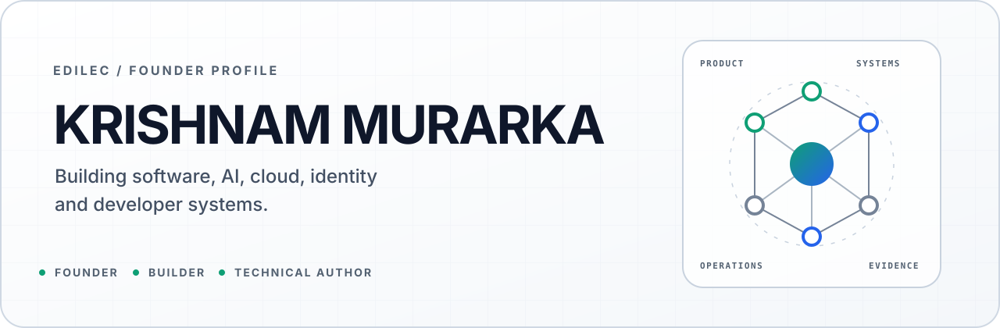
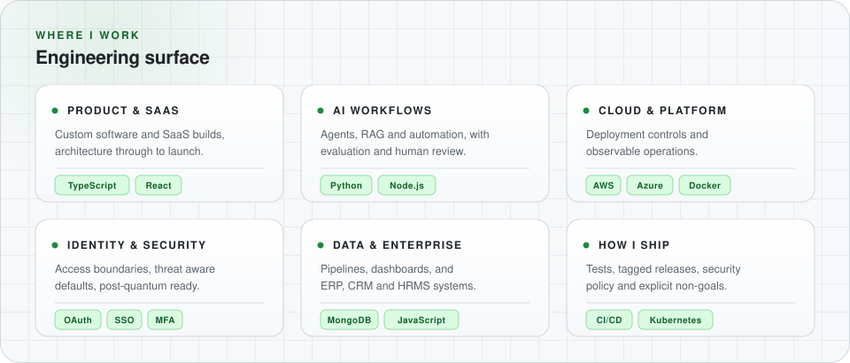

<picture>
<source media="(prefers-color-scheme: dark) and (max-width: 600px)" srcset="./assets/profile/krishnam-hero-mobile-dark.svg">
<source media="(max-width: 600px)" srcset="./assets/profile/krishnam-hero-mobile-light.svg">
<source media="(prefers-color-scheme: dark)" srcset="./assets/profile/krishnam-hero-dark.svg">
<source media="(prefers-color-scheme: light)" srcset="./assets/profile/krishnam-hero-light.svg">

</picture>

<h1 align="center">Krishnam Murarka</h1>

<strong>Founder &amp; CEO at <a href="https://edilec.com/">Edilec</a></strong> &nbsp;·&nbsp; Bengaluru, India &nbsp;·&nbsp; he/him 
Full stack developer building software from architecture through to what happens after launch.

> [!NOTE]
> **Building now.** Edilec's public engineering tools. The throughline
> is clear system boundaries, safe defaults, measurable releases, and evidence a
> reviewer can check without having to ask me for it.

## What I work on

Running Edilec since 2023 has taught me the parts that never show up in a demo:
production ownership, incident response, cost tradeoffs, and shipping a second
version once real usage shows what the first one got wrong.

I stay hands on across most of the stack, which makes me a versatile generalist
rather than a single stack specialist. The work below is the public slice of that.

<picture>
<source media="(prefers-color-scheme: dark) and (max-width: 600px)" srcset="./assets/profile/krishnam-surface-mobile-dark.svg">
<source media="(max-width: 600px)" srcset="./assets/profile/krishnam-surface-mobile-light.svg">
<source media="(prefers-color-scheme: dark)" srcset="./assets/profile/krishnam-surface-dark.svg">
<source media="(prefers-color-scheme: light)" srcset="./assets/profile/krishnam-surface-light.svg">

</picture>

## Maintained systems

| Project | What it does | Stack and evidence |
| :-- | :-- | :-- |
| **[Retry Jitter Lab](https://github.com/KRISHNAMMurarka/retry-jitter-lab)** | Deterministic simulations for comparing retry policies during outage recovery. | `Python 3.10+` `v0.1.0` `MIT` [Release](https://github.com/KRISHNAMMurarka/retry-jitter-lab/releases/tag/v0.1.0) · [Security](https://github.com/KRISHNAMMurarka/retry-jitter-lab/security/policy) |
| **[SVG Semantic Layout Auditor](https://github.com/edilec/svg-semantic-layout-auditor)** | Static accessibility, reference safety, dimension and text layout checks for SVG libraries. | `Node.js 20+` `v0.1.0` `MIT` `experimental` [Rules](https://github.com/edilec/svg-semantic-layout-auditor/blob/main/docs/rules.md) · [Security](https://github.com/edilec/svg-semantic-layout-auditor/security/policy) |
| **[Content Identity Auditor](https://github.com/edilec/content-identity-auditor)** | Audits content ID collisions, canonical identity and publication cadence, with deterministic JSON reports. | `Node.js 22+` `v0.1.0` `MIT` `experimental` [Release](https://github.com/edilec/content-identity-auditor/releases/tag/v0.1.0) · [Security](https://github.com/edilec/content-identity-auditor/security/policy) |
| **[Sitemap Cohort Auditor](https://github.com/edilec/sitemap-cohort-auditor)** | Exact sitemap cohort and release comparison across URL sets, image coverage and metadata quality. | `Node.js 20+` `v0.2.2` `MIT` [Release](https://github.com/edilec/sitemap-cohort-auditor/releases) · [Security](https://github.com/edilec/sitemap-cohort-auditor/security/policy) |
| **[inline-json-for-html](https://github.com/edilec/inline-json-for-html)** | Narrow, dependency free JSON serialization for HTML script element text. | `Node.js 22+` `v0.1.1` `MIT` [Release](https://github.com/edilec/inline-json-for-html/releases) · [Security](https://github.com/edilec/inline-json-for-html/security/policy) |

## Public engineering evidence

<picture>
<source media="(prefers-color-scheme: dark) and (max-width: 600px)" srcset="https://raw.githubusercontent.com/KRISHNAMMurarka/KRISHNAMMurarka/metrics-renders/assets/metrics/engineering-signal-mobile-dark.svg">
<source media="(max-width: 600px)" srcset="https://raw.githubusercontent.com/KRISHNAMMurarka/KRISHNAMMurarka/metrics-renders/assets/metrics/engineering-signal-mobile-light.svg">
<source media="(prefers-color-scheme: dark)" srcset="https://raw.githubusercontent.com/KRISHNAMMurarka/KRISHNAMMurarka/metrics-renders/assets/metrics/engineering-signal-dark.svg">

</picture>

Refreshed automatically from an explicit repository allowlist. Nothing here is hand typed.

## Writing

Longer form architecture notes, mostly about the decisions rather than the syntax.

- [How AI Agents Work in Business Workflows](https://edilec.com/blog/ai-1024/how-ai-agents-work-in-business-workflows/)
- [ERP, CRM and Workflow Integration Guide](https://edilec.com/blog/ent-5204/erp-crm-and-workflow-integration-guide/)
- [SaaS Architecture for Startups and Internal Products](https://edilec.com/blog/prod-7102/saas-architecture-for-startups-and-internal-products/)

<a href="https://edilec.com/authors/krishnam-murarka/"><strong>Browse all writing →</strong></a>

## Off the keyboard

Certified Scuba Divemaster, paraglider and snowboarder. Mostly there for the
adrenaline, though it turns out that staying calm under pressure ports fairly
directly to production incidents.

Finishing a BSc in Computer Science at BITS Pilani alongside the work.

> [!IMPORTANT]
> Open to conversations about full stack and cloud engineering roles, technical
> co-founder fits, or comparing notes with anyone building in AI, identity or
> infrastructure. Best reached at **[hello@edilec.com](mailto:hello@edilec.com)**.
